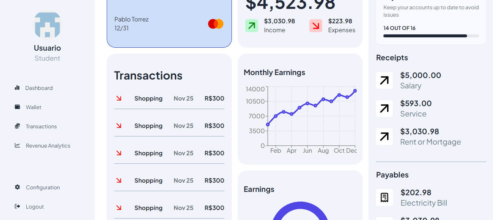

# Gestor de Finanzas - Frontend Stack: React JS, TailwindCSS/DaisyUI



### RECURSOS ADICIONALES:
- TAILWIND CSS DOCUMENTATION: https://tailwindcss.com/docs
- DaisyUI Components: https://daisyui.com
- FIGMA COMMUNITY: Buscar plantillas y ejemplos en la comunidad de Figma
- LocalStorage Guide: https://developer.mozilla.org/es/docs/Web/API/Window/localStorage

## Instalaciones / Dependencias

1. Tener instalado Node JS: https://nodejs.org/es/

2. Para instalar Tailwind CSS:
- ```$ npm install -D tailwindcss postcss autoprefixer```
- ```$ npx tailwindcss init -p```

- Esto crea los archivos `tailwind.config.js` y `postcss.config.js`
- En `tailwind.config.js` agregar en 'content' esto:
```
content: [
    "./index.html",
    "./src/**/*.{js,ts,jsx,tsx}",
],
```

3. Instalar daisyUI como un paquete npm:

```npm i -D daisyui@latest```

- Agregar daisyUI a tailwind.config.js:

```import daisyui from "daisyui"
module.exports = {
  //...
  plugins: [
    daisyui,
  ],
}
```

4. Tener instalado React Router

```npm install react-router-dom```

5. Paquete recharts
```bash 
npm install recharts
```